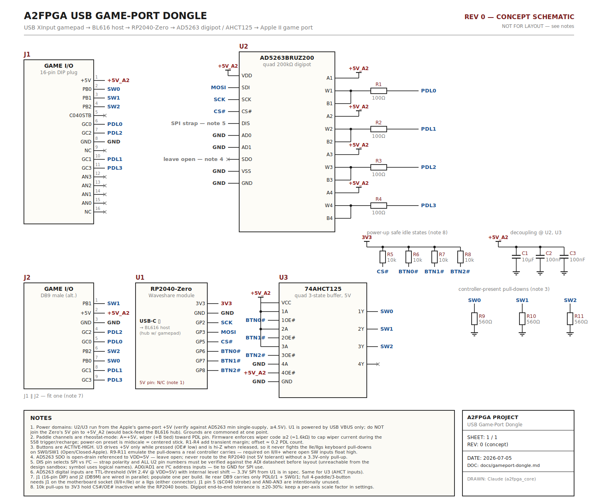

# USB Game-Port Dongle (design note, rev 0)

Transparent gamepad→Apple II joystick support by injecting *real* analog resistances and
button levels into the game port — the one place the signals can be faked on every Apple II
model without touching the data bus. Companion to (not a replacement for) the planned
**4play/SNES-MAX virtual card** in the FPGA, which is software-visible only to patched games.

**Status:** rev 0 concept — schematic drawn, not laid out. See
[Open items before layout](#open-items-before-layout).



Rendered schematic: [`images/gameport-dongle-schematic.svg`](images/gameport-dongle-schematic.svg)

## Why a dongle (and not bus override)

We investigated overriding softswitch reads of `$C061–$C067` from the slot. Verdict per host:

| Host | Can a slot card's data reach the CPU at `$C06x`? | Detail |
|---|---|---|
| II / II+ | Electrically yes, **but** D7 fights a 74LS251 that drives HIGH with an empty port; a 3.3 V 8 mA-class driver settles near the 6502's 0.8 V V<sub>IL</sub> — unreliable, ~30–100 mA contention per read | No buffer between slots and motherboard bus; 8T28s point toward the CPU on reads |
| IIe | Same D7 fight; **faking a button press (drive HIGH vs. LS low, 24 mA sink) effectively always loses** | B2 74LS245 points slot→MD during φ0 of `$C020–$C0FF` reads (MMU `MD IN/OUT` logic), so the path exists — the LS251 contention kills it |
| IIgs | **No.** `$C06x` is served by the Mega II on the internal MDBUS; the slot-side 74HCT245 drives *outward* — and Apple TN #32 warns contention "can damage the Mega II" | No sanctioned cycle type lets a card answer these addresses |

No product in ~40 years overrides motherboard `$C0xx` from a slot; the joystick-card
ecosystem (4play, SNES MAX) uses its own DEVSEL space plus per-game patches instead.
The game port itself, however, expects a *passive resistance* (paddle) and *switch levels*
(buttons) — trivially and safely synthesizable at the connector on every model.

## System architecture

```
USB XInput gamepad ─┐
                    ├─ USB hub ── BL616 (CherryUSB host, a2n20v2-Enhanced)
dongle (this board) ┘                │ existing SPI link
                                     └── FPGA (menu/OSD, settings)

dongle: RP2040-Zero ── SPI ──> AD5263 (4× 200kΩ digipot)  ──> PDL0–PDL3
        (USB CDC dev)  GPIO ──> 74AHCT125 (3-state, 5 V)   ──> SW0–SW2
```

The BL616 already polls the gamepad; it forwards stick/button state to the dongle as a
small CDC frame. The dongle converts it to resistance (paddles) and 5 V switch levels
(buttons). Everything the Apple sees is indistinguishable from a real analog joystick.

## Circuit description

### Paddles (PDL0–PDL3)

Each AD5263 channel is wired as a rheostat: terminal A to the game port's +5 V, wiper
(with B tied to W) through a 100 Ω series resistor to the PDL pin — exactly the topology of
a real 150 kΩ paddle. The motherboard's NE558 (or Mega II) one-shot then times out against
our programmed resistance: `t ≈ 1.1·R·C`, `C = 0.022 µF`, PREAD count ≈ `t / 11 µs`.

- **200 kΩ grade required** (AD5263BRUZ**200**): 150 kΩ full-scale sits at code ~192 of 256.
  Step size 781 Ω ≈ 1.3 PDL counts — well below stick jitter/deadzone.
- **Firmware wiper-code floor ≥ 2** (≈1.6 kΩ): at code 0 the channel is ~60 Ω of wiper
  resistance and the 558 trigger/recharge would pull tens of mA through it (abs-max
  violation territory). The floor caps it at ~3 mA and costs readings 0–1 only.
- Power-on preset is midscale = centered stick — benign before the RP2040 enumerates.
- End-to-end tolerance is ±20–30 %: keep a **per-axis scale factor** in settings, calibrated
  once against a paddle-test utility.

### Buttons (SW0–SW2)

Active-high: a real button connects the SW line to +5 V. The 74AHCT125 (powered at 5 V,
TTL-compatible inputs so 3.3 V GPIO drives it) has its data inputs tied high and uses the
per-channel output enables as the "button": OE# low = drive 5 V (pressed), OE# high =
**hi-Z** (released). Hi-Z when released matters — on the IIe/IIgs, SW0/SW1 are shared with
the Open/Closed-Apple keys and are held low by keyboard pull-downs; driving low would fight
them and block those keys.

560 Ω pull-downs (R9–R11) replicate the pull-downs a real controller carries. They're
required on the II/II+, where an empty port leaves the LS251 inputs floating high
("button stuck pressed"); with the dongle plugged in, released reliably reads 0.

Do **not** drive SW lines from raw RP2040 GPIO: 3.3 V is marginal against the IIgs input
threshold, and the RP2040 is not 5 V-tolerant if anything else (Y-cable, keyboard circuit)
puts 5 V on the line.

### Power domains

- **+5V_A2** (game-port pin): powers the AD5263 and 74AHCT125, so all analog terminals and
  button levels are referenced to the Apple's own rail. Verify the exact AD5263 grade's
  minimum single supply (≥4.5 V) against a sagging Apple PSU; if the margin is uncomfortable,
  power U2/U3 from USB 5 V instead **and confirm** USB 5 V ≥ port 5 V so terminals never
  exceed V<sub>DD</sub>.
- **USB VBUS**: powers the RP2040-Zero only. **Never** join the Zero's 5 V pin to +5V_A2
  (it would back-feed the BL616's hub port). Grounds common at one point.
- 10 k pull-ups to 3V3 on CS# and the three OE# lines keep everything inactive while the
  RP2040 boots or is unplugged.

### Interfaces

- **RP2040 → AD5263:** SPI, 11-bit words (3 address + 8 data bits), ≤10 MHz. AD5263 inputs
  are TTL-threshold (V<sub>IH</sub> 2.4 V at V<sub>DD</sub>=5 V) with internal level shift —
  3.3 V SPI is in spec. SDO is open-drain referenced to 5 V: leave open.
- **BL616 → RP2040:** USB CDC-ACM (TinyUSB device on the dongle; small CherryUSB CDC host
  class driver added to `firmware_host`). Suggested frame, sent at the XInput poll rate:
  `[0xA5, pdl0, pdl1, pdl2, pdl3, btn_mask, seq]` — idempotent, no ack needed. Added
  latency is one USB hop (4–8 ms), negligible against the ~3 ms paddle scan itself.

### Connectors

J1 (16-pin DIP plug, motherboard socket) and J2 (DB9 male, IIe/IIgs rear) are wired in
parallel — populate one per cable build. The IIe rear DB9 carries only PDL0/1 + SW0/1;
full 4-paddle/3-button needs J1 (II/II+/IIe) or a IIgs (either connector). `$C040` strobe
(J1 pin 5) and AN0–AN3 are intentionally unused.

## RP2040-Zero pin map

| GPIO | Function |
|---|---|
| GP2 | SPI SCK → U2 |
| GP3 | SPI MOSI → U2 SDI |
| GP5 | CS# → U2 (10 k pull-up to 3V3) |
| GP6/GP7/GP8 | BTN0#/BTN1#/BTN2# → U3 OE# (10 k pull-ups to 3V3, low = pressed) |
| 3V3 out | pull-up rail |
| 5V pin | **no connect** |

## BOM (active parts)

| Ref | Part | Notes |
|---|---|---|
| U1 | Waveshare RP2040-Zero | USB-C CDC device; castellated module |
| U2 | AD5263BRUZ200 | quad 256-pos digipot, **200 kΩ grade**, TSSOP-24 |
| U3 | 74AHCT125 (SOIC-14) | 5 V, 3-state; TTL inputs accept 3.3 V |
| R1–R4 | 100 Ω | wiper series protection |
| R5–R8 | 10 k | CS#/OE# idle-safe pull-ups to 3V3 |
| R9–R11 | 560 Ω | SW pull-downs (controller-present emulation) |
| C1–C3 | 10 µF + 2×100 nF | on +5V_A2 at U2/U3 |
| J1 / J2 | 16-pin DIP plug / DB9M | fit one |

Fallback if AD5263 availability is poor: 2 × AD5262 (dual, 200 kΩ grade), same wiring.

## Open items before layout

1. **Verify all AD5263 pin numbers and the DIS (SPI/I²C select) strap polarity** against the
   ADI datasheet — the schematic uses logical pin names (datasheet PDF hosts were
   unreachable from the design environment).
2. **Confirm AD5263 minimum single-supply voltage** for the chosen grade vs. a worst-case
   Apple +5 V rail (~4.75 V); decide +5V_A2 vs. USB power for U2/U3 accordingly.
3. **Confirm abs-max wiper/terminal current** and re-check the code-floor math.
4. Bench-check PB2 behavior on a IIe with the shift-key mod (X6 pad) before mapping a
   gamepad button to SW2 by default.
5. Decide cable strategy (DIP-16 with DB9 breakout vs. two SKUs).
6. BL616 side: add CDC-ACM host driver + settings page (axis scale/invert, button mapping,
   PDL2/3 source: right stick vs. second pad).

## See also

- [bus-interface.md](bus-interface.md) — why cards normally answer only slot-decoded space.
- `boards/a2n20v2-Enhanced/src/a2n20_bl616/firmware_host/` — the USB host firmware this
  extends.
